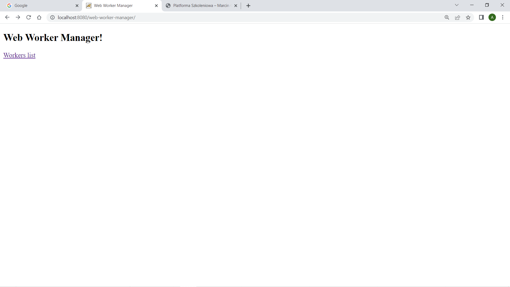
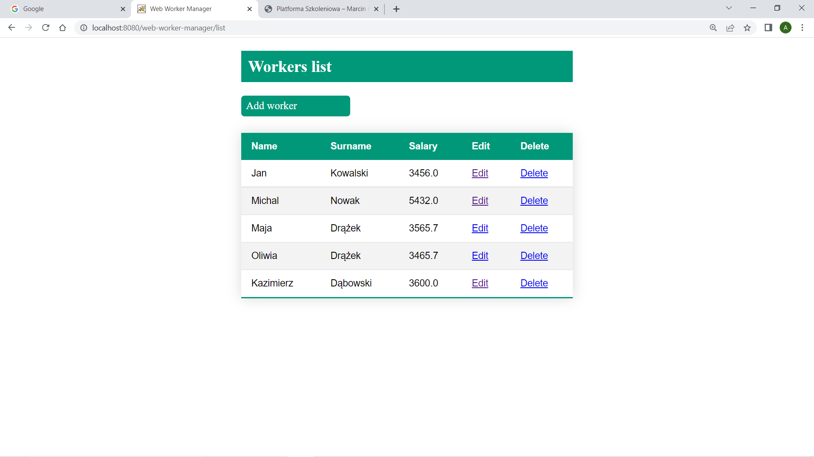
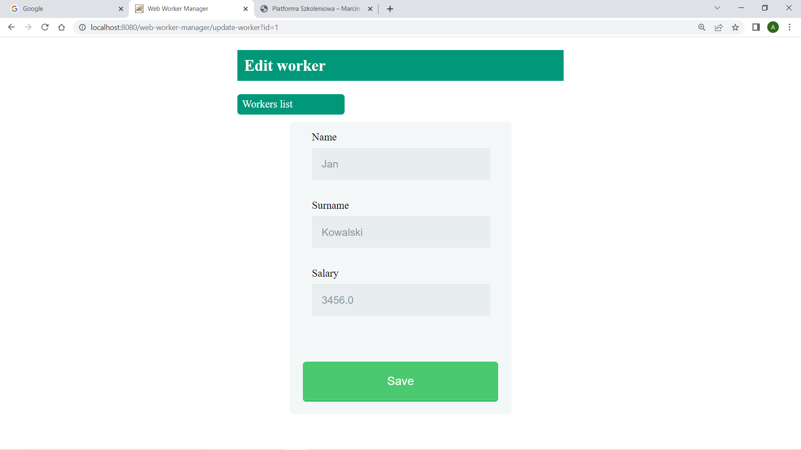
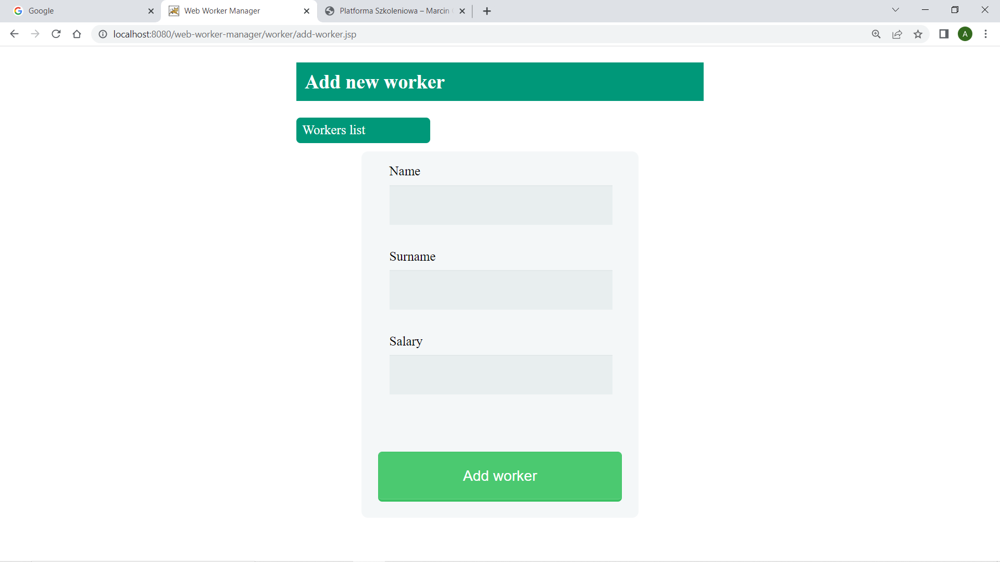
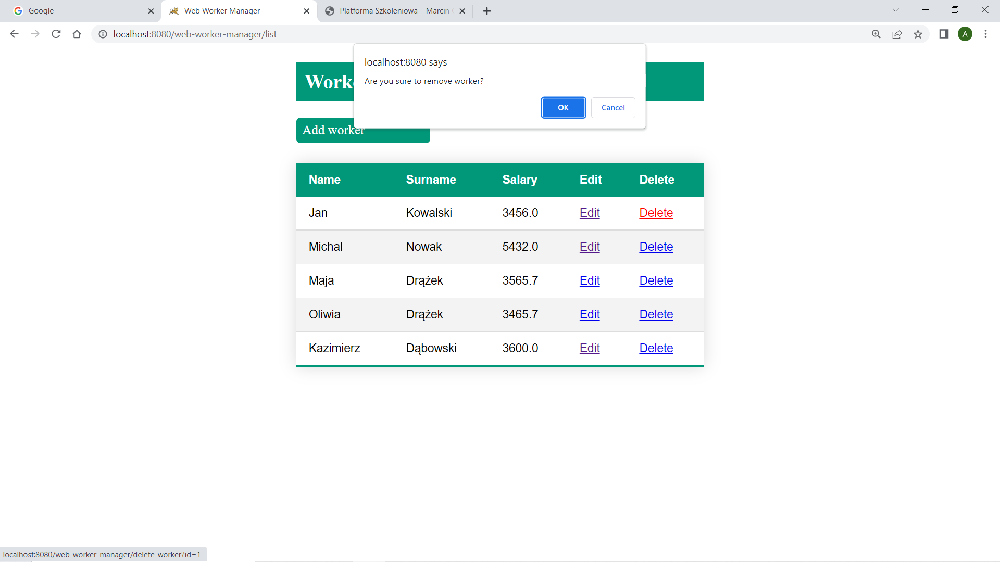

# Web Worker Manager

## General Information
The app is employee data management from the web interface linked to workers database. The application is based on CRUD (Create, Read, Update, and Delete) standard and built on the basis of the REST API architecture. The application uses the MVC (Model - View - Controller) design pattern. The Model is represented by MySQL database, View is based on JSP technology and Controller is a Servlet. The application is used to manage the employee base and implements CRUD functionalities:
- creating a new employee (CREATE - INSERT(MySQL))
- reading the employee from the database (READ - SELECT(MySQL))
- modifying an employee (UPDATE - UPDATE(MySQL))
- removing an employee (REMOVE - REMOVE(MySQL))

## Screenshots
### Home website

### Workers list table website

### Update worker form website

### Add worker form website

### Delete worker confirm window website

## Technologies Used
- Java version 1.8 (back end)
- JSP (back end)
- MySQL
- XML (front end)
- CSS (front end)
- Maven
- REST API
- XAMPP
- Tomcat

## Design patterns:
- MVC (Model: MySql, View: JSP, Controller: Servlet)
- PRG (Post/Redirect/Get)
- CRUD (Create, Read, Update, Delete)

## Features
- creating an employee in the database
- adding an employee in the database
- modification of an employee in the database
- editing an employee in the database
- removing an employee in the database
- Workers list button
- Add worker button
- Edit link
- Delete link
- Workers list link
- Customizable workers name in database
- Customizable workers surname in database
- Customizable workers salary in database

## Usage
Run:
- Java version 1.8
- Tomcat version 9.0.62
- MySQL database by XAMPP APP
- http://localhost:8080/web-worker-manager/

## Room for Improvement
- Managing of students at school/university
- web restaurant
- web pizzeria
- web shop
- add a new table with departments for employees.
- implement CRUD for departments
- assigning employees to specific departments